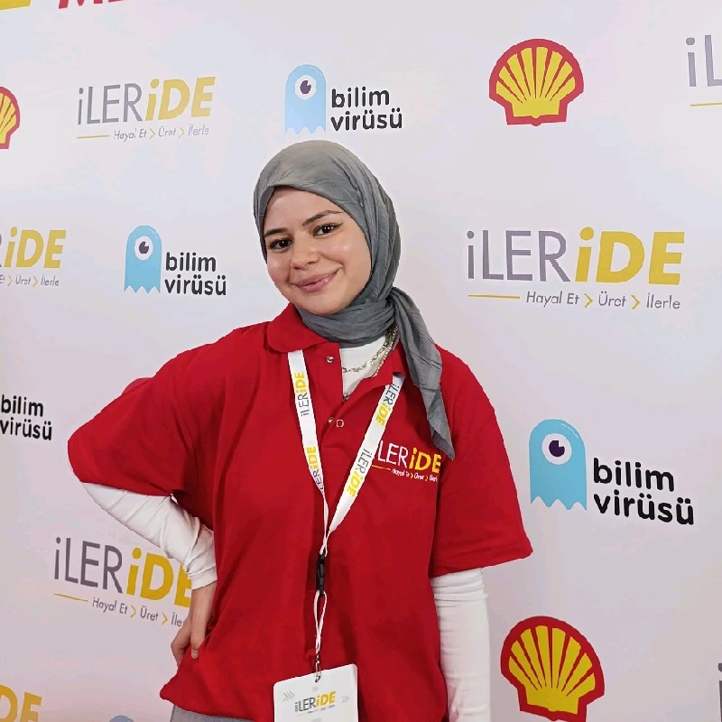
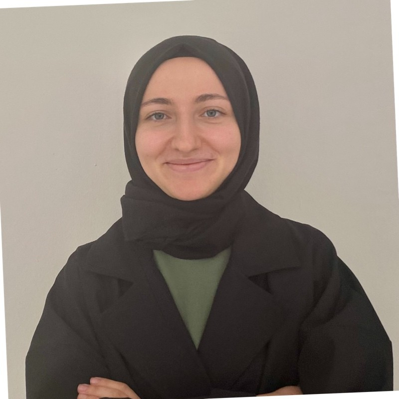
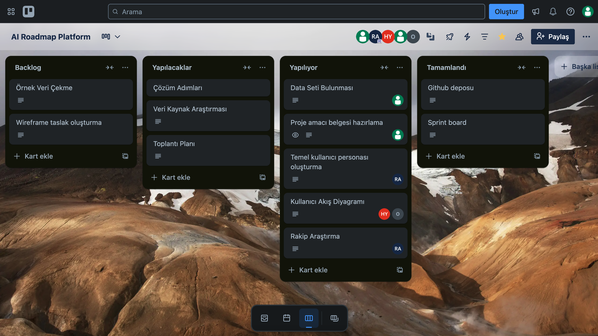
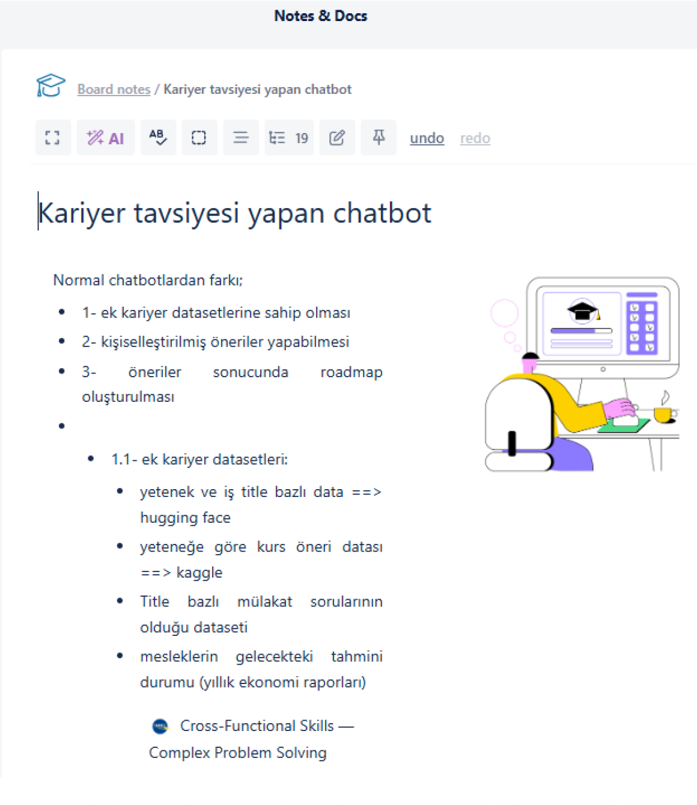

# Sprint 1 Raporu
## Ürün Adı: AI Roadmap Platform 
Kullanıcıdan alınan bilgiler (eğitim durumu, yazılım dilleri, hedefler, dil seviyesi, çalışma tercihi vb.) ışığında kişiye özel yapay zekâ tabanlı bir kariyer yol haritası oluşturmayı amaçlayan bir platformdur.
##  Takım: Yapay Zeka Grup 41

## Takım Üyeleri

<table>
  <tr>
    <td align="center">
       
      <strong>Rümeysa Acar</strong> 
      Scrum Master 
      <a href="https://www.linkedin.com/in/rumeysaacar/">LinkedIn</a>
    </td>
    <td align="center">
       
      <strong>Muhammed Selim Özlen</strong> 
      Product Owner 
      <a href="https://www.linkedin.com/in/selim-ozlen/">LinkedIn</a>
    </td>
    <td align="center">
       
      <strong>Zehra Nur Öztürk</strong> 
      Developer 
      <a href="https://www.linkedin.com/in/zehranur%C3%B6zt%C3%BCrk/">LinkedIn</a>
    </td>
    <td align="center">
       
      <strong>Hatice Yalçın</strong> 
      Developer 
      <a href="https://www.linkedin.com/in/haticeyalcinn/">LinkedIn</a>
    </td>
    <td align="center">
       
      <strong>Mert Can Obalı</strong> 
      Developer 
      <a href="https://www.linkedin.com/in/mert-can-obal%C4%B1/">LinkedIn</a>
    </td>
  </tr>
</table>

##  Sprint 1 Notları

- Proje yönetimi için **Trello** kullanılmasına karar verilmiştir.
- Yetenek–pozisyon eşleştirmesi için Hugging Face veri setleri kullanılacaktır.
- Yeteneklere göre kurs önerileri için Kaggle veri setlerinden faydalanılacaktır.
- Mülakat soruları için meslek bazlı özel veri seti planlanmaktadır.
- Mesleklerin gelecekteki durumu için yıllık ekonomi raporları değerlendirilecektir.
- Kullanıcıdan alınacak bilgiler için bir form hazırlanacaktır (eğitim durumu, yazılım dilleri, hedefler, dil seviyesi, çalışma tercihi vb.)
- Bu bilgilerden yola çıkarak kişiselleştirilmiş öneriler sunulacak ve kullanıcıya bir roadmap oluşturulacaktır.

## Sprint İçinde Tamamlanması Tahmin Edilen Puan
100 puan

## Puan Tamamlama Mantığı
Toplam proje sürecinde yaklaşık 300 puanlık iş planlanmıştır. Bu puan, 3 sprint'e bölünerek her sprint için yaklaşık 100 puanlık hedefler belirlenmiştir. Sprint 1 için hedef 100 puan olup; proje vizyonu, araç seçimi ve temel yapının hazırlanmasına ayrılmıştır.
- **Toplam Proje Puanı:** 300 puan → 3 Sprint’e bölündü.
- Sprint 1 için hedef 100 puan olup; proje vizyonu, araç seçimi ve temel yapının hazırlanmasına ayrılmıştır.
  

## Daily Scrum
Daily Scrum toplantıları Cuma günleri Google Meet üzerinden yapılmıştır. Daily Scrum toplantısı örneğine aşağıdaki bağlantıdan ulaşabilirsiniz.
📎 [Toplantı Örneği Bağlantısı](https://yapayzekagrup41.notion.site/)

## Sprint Board Özeti: Sprint Board Ekran Görüntüsü

  

Sprint board, Trello üzerinde dört sütun hâlinde yapılandırılmıştır: Backlog, Yapılacaklar, Yapılıyor, Tamamlandı. Her bir sütun, product backlog’tan seçilen story’lerin ve bu story’lere bağlı task’ların durumlarını yansıtmaktadır. Story’ler, geliştirme sürecini daha verimli yönetmek adına daha küçük iş parçacıkları olan task’lara bölünmüştür.

## ✅ Tamamlananlar

- Proje konusu belirlendi.
- GitHub reposu oluşturuldu.
- Sprint board yapılandırıldı.
- Dataset araştırması yapıldı.
- Proje amacı belgesi hazırlandı.

  

## Sprint Review
- Dataset’lerin uygunluğunun test edilmesine karar verildi (Hugging Face, Kaggle).
- Wireframe detayları bir sonraki sprint’e aktarıldı.
-Bu sprintte teknik geliştirme yerine araştırma ve yapılandırmaya odaklanıldı.

## Sprint Retrospective
- Araştırma görevleri için başlangıçta zaman tahmini zor oldu, bu nedenle sonraki sprint’te task'lar daha küçük parçalara bölünerek planlanacak.
- Daily Scrum’lar ekip içi iletişimi olumlu etkiledi.
- Bir sonraki sprint’te uygulama geliştirme önceliklendirilecek.

## 📝 Kararlaştırılan Görev Dağılımı

| Takım Üyesi              | Görevler                                                                 |
|--------------------------|--------------------------------------------------------------------------|
| **Rümeysa Acar**         | Scrum yönetimi, toplantı koordinasyonu, rakip araştırması, temel kullanıcı personası oluşturma |
| **Zehra Nur Öztürk**     | Proje amacı belgesi hazırlama, Sprint 1 raporlaması                      |
| **Muhammed Selim Özlen** | Dataset araştırması, veri kaynaklarının belirlenmesi                     |
| **Hatice Yalçın**        | Kullanıcı akış diyagramı                                                 |
| **Mert Can Obalı**       | Kullanıcı akış diyagramı                                                 |

